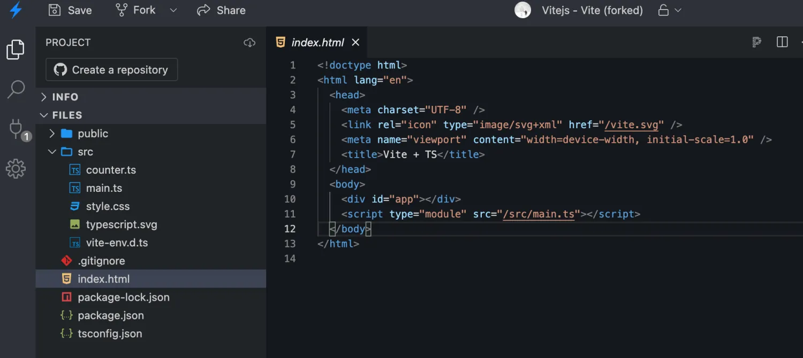

# 0001. 从 0 到 1 搭建一个原生的（vanilla） vite 工程

## 📝 summary

- 本节内容：从 0 到 1 搭建一个 vite 的原生 demo

## 🔗 links

- https://github.com/vitejs/vite/tree/main/packages/create-vite/template-vanilla-ts
  - github -- vite -- template-vanilla-ts
  - 本节要从 0 到 1 搭建的 demo 的效果，其实跟这个官方提供的 vanilla-ts 的模板基本一致。
  - 单词：vanilla 表示存粹的意思。
- https://cn.vitejs.dev/guide/#trying-vite-online
  - vite -- vanilla-ts
  - 官方提供的 vanilla-ts 模板
    - 
- https://cn.vitejs.dev/guide/features.html#typescript
  - Vite，指引 - 功能 - TypeScript。查看 Vite 对 TS 的支持的详情。

## 📝 notes - vite 是比 webpack 更上层的工具链

vite 是一个上层的工具链，它帮我们预先配置好的很多东西，你只需要安装 vite 就可以实现 dev server、build 等操作。而且 build 出来的产物，也是自带文件指纹的。从开箱即用的角度来对比，vite 比 webpack 做得更加全面，你只需要一两分钟，就能搭建好一个原生的 vite-demo 了，并且还带有 TypeScript 支持。

## 📝 notes - 单词 vanilla

- vanilla - “纯粹”
- 发音：`/vəˈnɪlə/`
- “Vanilla” 代表的是 **纯粹**、简单和直接的编程方式，强调不依赖额外的框架或库，而是直接使用 **原生** 的语言和技术。

## 📝 notes - 官方提供的 vanilla-ts 模板

- 
- 通过本节示例最终搭建出来的 demo 效果和官网提供的 vanilla-ts 的示例是非常类似的，主要区别在于我们的 demo 缺少了一些 ts 配置信息。我们可以在写完之后去到官方文档中对比一下看看。
- 可以点进去，通过 StackBlitz 在线查看 vanilla-ts 的模板源码。
- 
- 也可以通过以下命令在本地创建

```bash
$ npm create vite@latest my-vanilla-ts -- --template vanilla-ts
```

## 📝 notes - Vite 对 TS 的支持

- Vite 天然支持引入 .ts 文件。注意，Vite 仅执行 .ts 文件的转译工作，并 **不执行** 任何类型检查。

## 💻 demo

```bash
# 创建 vite-demo 目录
$ mkdir vite-demo
# 进入 vite-demo
$ cd vite-demo
# 安装 vite
$ pnpm add vite -D
# 安装 TypeScript（建议装）
$ pnpm add typescript -D
# 新建入口文件 index.html
# doc：https://cn.vitejs.dev/guide/#index-html-and-project-root
$ touch index.html
```

```html
<!-- index.html -->
<!DOCTYPE html>
<html lang="en">
<head>
  <meta charset="UTF-8">
  <meta name="viewport" content="width=device-width, initial-scale=1.0">
  <title>Document</title>
</head>
<body>
  <div id="app"></div>
</body>
<script type="module" src="./src/index.ts"></script>
</html>
```

```ts
// src/index.ts
import { setupCounter } from "./counter";

document.querySelector('#app')!.innerHTML = `
  <div>
    <button id="counter" type="button"></button>
  </div>
`;
setupCounter(document.querySelector('#counter') as HTMLButtonElement);
```

```ts
// src/counter.ts
export function setupCounter(element: HTMLButtonElement) {
  let counter = 0;
  const setCounter = (count: number) => {
    counter = count;
    element.innerHTML = `Counter: ${counter}`;
  }
  setCounter(0);
  element.addEventListener('click', () => setCounter(counter + 1));
}
```

```json
// package.json
{
  "name": "vite-demo",
  "version": "1.0.0",
  "description": "",
  "main": "index.js",
  "scripts": {
    "dev": "vite",
    "build": "vite build",
    "preview": "vite preview"
  },
  "keywords": [],
  "author": "",
  "license": "ISC",
  "devDependencies": {
    "typescript": "^5.2.2",
    "vite": "^4.4.9"
  },
  "packageManager": "pnpm@9.0.4+sha512.c374b52de3de88c58fd8333df664a737279cdb0e1344ba4054d3b1fffa9a1a3670854f755dca4f16adea3f14be9896a7fcaf167409fe0c1ad60475271dafe81a"
}
```

- 无需任何其它的配置，现在已经可以正常完成以下操作：
- 【开发环境】启动开发服务器，执行命令 `npm run dev`
- 【生产环境】出包，执行命令 `npm run build`，预览构建产物，执行命令 `npm run preview`