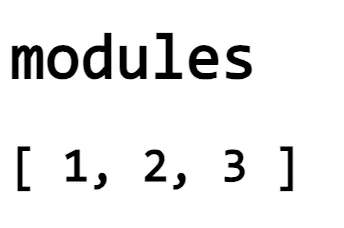
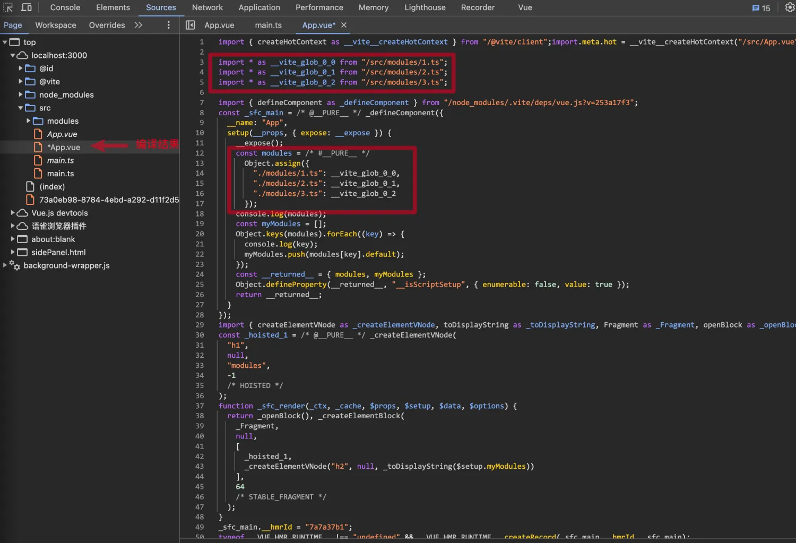
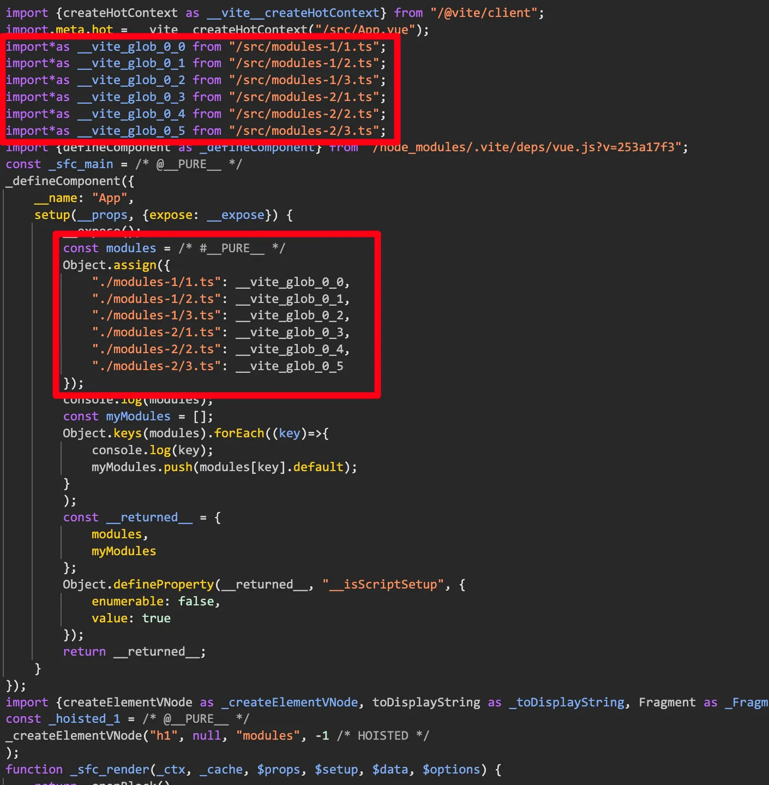
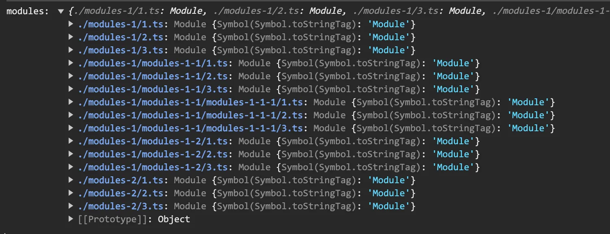
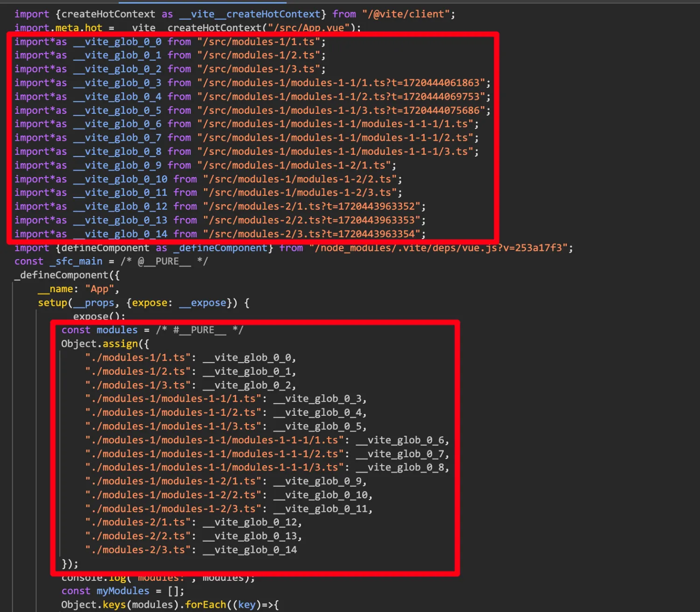

# [0002. 一次性导入所有模块](https://github.com/Tdahuyou/vite/tree/main/0002.%20%E4%B8%80%E6%AC%A1%E6%80%A7%E5%AF%BC%E5%85%A5%E6%89%80%E6%9C%89%E6%A8%A1%E5%9D%97)


## 📝 summary

- 本文内容：介绍 `import.meta.glob` 的基本使用

## 🔗 links

- https://vitejs.dev/guide/features.html#glob-import
  - vite 官方文档 -- Vite，Features，Glob Import

## 📒 notes - `import.meta.glob` 的一些常见用法

- 从 **指定单一目录** 中导入满足要求的所有模块。

```ts
import.meta.glob('./modules/*.ts', { eager: true })
```

- 从 **多个目录** 中导入满足要求的所有模块。

```ts
const modules = import.meta.glob(
  ['./modules-1/*.ts', './modules-2/*.ts',],
  { eager: true }
)
```

- **递归导入** 的写法。

```ts
const modules = import.meta.glob(
  ['./modules-1/**/*.ts', './modules-2/*.ts',],
  { eager: true }
)
// ./modules-1/**/*.ts
// 这么写意味着从 modules-1 中导入所有所有模块
// 包括那些嵌套的模块也会被导入

// ./modules-2/*.ts
// 这么写意味着仅导入一层
// 不包括嵌套的模块
```

- 匹配 **多种后缀** 的写法。

```ts
const modules = import.meta.glob(
  ['./modules-1/**/*.{json,ts,js}', './modules-2/*.ts',],
  { eager: true }
)
// './modules-1/**/*.{json,ts,js}'
// 导入 modules-1 目录下的所有模块
// 包括嵌套模块
// 这些模块以 json 或 ts 或 js 为后缀
```

## 📒 notes - 理解语法糖 `import.meta.glob` 的基本原理

- 问：语法糖 `import.meta.glob(..., { eager: true })` 的等效写法（编译结果）是什么？

```ts
const modules = import.meta.glob('./modules/*.ts', { eager: true })

// 假设目录结构如下
// ├── App.vue # 在 App.vue 中导入 modules 下的所有模块
// ├── main.ts
// ├── modules
// │   ├── 1.ts
// │   ├── 2.ts
// │   └── 3.ts
// └── vite-env.d.ts

// 经过 vite 编译后，生成的结果如下。
import * as __vite_glob_0_0 from "/src/modules/1.ts";
import * as __vite_glob_0_1 from "/src/modules/2.ts";
import * as __vite_glob_0_2 from "/src/modules/3.ts";

const modules = Object.assign({
  "./modules/1.ts": __vite_glob_0_0,
  "./modules/2.ts": __vite_glob_0_1,
  "./modules/3.ts": __vite_glob_0_2
});

// 相当于一个语法糖
// 将所有的模块一次性导入
// 然后以模块的相对路径为 key
// 模块导出的内容为 val
// 形成一个对象返回
```

## 💻 demo1 - 导入 modules 中的所有 .ts 文件

- src 目录结构

```bash
$ tree
.
├── App.vue # 在 App.vue 中导入 modules 下的所有模块
├── main.ts
├── modules
│   ├── 1.ts
│   ├── 2.ts
│   └── 3.ts
└── vite-env.d.ts
```

- 模块内容

```ts
// src/modules/1.ts
export const a = 1
export default 1
```

```ts
// src/modules/2.ts
export const b = 2
export default 2
```

```ts
// src/modules/3.ts
export const c = 3
export default 3
```

- 导入测试

```vue
<!-- src/App.vue -->
<script setup lang="ts">
const modules = import.meta.glob('./modules/*.ts', { eager: true }) as Record<string, any>
console.log(modules)
// {
//     "./modules/1.ts": {
//         "a": 1,
//         "default": 1
//     },
//     "./modules/2.ts": {
//         "b": 2,
//         "default": 2
//     },
//     "./modules/3.ts": {
//         "c": 3,
//         "default": 3
//     }
// }

const myModules: any[] = []
Object.keys(modules).forEach((key) => {
  console.log(key)
  // ./modules/1.ts
  // ./modules/2.ts
  // ./modules/3.ts

  myModules.push(modules[key].default)
})
</script>

<template>
  <h1>modules</h1>
  <h2>{{ myModules }}</h2>
</template>
```

- **最终效果**
  - 
  - 
- **编译结果分析**

```ts
const modules = import.meta.glob('./modules/*.ts', { eager: true })
// 经过 vite 编译后，生成的结果如下。
import * as __vite_glob_0_0 from "/src/modules/1.ts";
import * as __vite_glob_0_1 from "/src/modules/2.ts";
import * as __vite_glob_0_2 from "/src/modules/3.ts";

const modules = Object.assign({
  "./modules/1.ts": __vite_glob_0_0,
  "./modules/2.ts": __vite_glob_0_1,
  "./modules/3.ts": __vite_glob_0_2
});

// 相当于一个语法糖
// 将所有的模块一次性导入
// 然后以模块的相对路径为 key
// 模块导出的内容为 val
// 形成一个对象返回
```



```ts
// App.vue（编译结果）
import { createHotContext as __vite__createHotContext } from "/@vite/client";import.meta.hot = __vite__createHotContext("/src/App.vue");

import * as __vite_glob_0_0 from "/src/modules/1.ts";
import * as __vite_glob_0_1 from "/src/modules/2.ts";
import * as __vite_glob_0_2 from "/src/modules/3.ts";

import { defineComponent as _defineComponent } from "/node_modules/.vite/deps/vue.js?v=253a17f3";
const _sfc_main = /* @__PURE__ */ _defineComponent({
  __name: "App",
  setup(__props, { expose: __expose }) {
    __expose();
    const modules = /* #__PURE__ */
      Object.assign({
        "./modules/1.ts": __vite_glob_0_0,
        "./modules/2.ts": __vite_glob_0_1,
        "./modules/3.ts": __vite_glob_0_2
      });
    console.log(modules);
    const myModules = [];
    Object.keys(modules).forEach((key) => {
      console.log(key);
      myModules.push(modules[key].default);
    });
    const __returned__ = { modules, myModules };
    Object.defineProperty(__returned__, "__isScriptSetup", { enumerable: false, value: true });
    return __returned__;
  }
});
import { createElementVNode as _createElementVNode, toDisplayString as _toDisplayString, Fragment as _Fragment, openBlock as _openBlock, createElementBlock as _createElementBlock } from "/node_modules/.vite/deps/vue.js?v=253a17f3";
const _hoisted_1 = /* @__PURE__ */ _createElementVNode(
  "h1",
  null,
  "modules",
  -1
  /* HOISTED */
);
function _sfc_render(_ctx, _cache, $props, $setup, $data, $options) {
  return _openBlock(), _createElementBlock(
    _Fragment,
    null,
    [
      _hoisted_1,
      _createElementVNode("h2", null, _toDisplayString($setup.myModules))
    ],
    64
    /* STABLE_FRAGMENT */
  );
}
_sfc_main.__hmrId = "7a7a37b1";
typeof __VUE_HMR_RUNTIME__ !== "undefined" && __VUE_HMR_RUNTIME__.createRecord(_sfc_main.__hmrId, _sfc_main);
import.meta.hot.accept((mod) => {
  if (!mod) return;
  const { default: updated, _rerender_only } = mod;
  if (_rerender_only) {
    __VUE_HMR_RUNTIME__.rerender(updated.__hmrId, updated.render);
  } else {
    __VUE_HMR_RUNTIME__.reload(updated.__hmrId, updated);
  }
});
import _export_sfc from "/@id/__x00__plugin-vue:export-helper";
export default /* @__PURE__ */ _export_sfc(_sfc_main, [["render", _sfc_render], ["__file", "/Users/huyouda/Desktop/vite-project/src/App.vue"]]);

//# sourceMappingURL=
```

## 💻 demo2 - 导入 modules-1 和 modules-2 中的所有 .ts 文件

- src 目录结构

```bash
$ tree
├── App.vue # 在 App.vue 中，捞出 modules-1 和 modules-2 中的所有 .ts 文件
├── main.ts
├── modules-1
│   ├── 1.ts
│   ├── 2.ts
│   └── 3.ts
├── modules-2
│   ├── 1.ts
│   ├── 2.ts
│   └── 3.ts
└── vite-env.d.ts
```

- 实现方式分析
  - **做法 1：**可以和 demo1 的写法保持一致，写两条 `import.meta.glob` 语句就行。
  - **做法 2：**`import.meta.glob` 的第一个参数可以传入一个字符串数组，将所有需要导入的模块丢里边即可。
- 导入测试

```vue
<!-- App.vue -->
<script setup lang="ts">
const modules = import.meta.glob(['./modules-1/*.ts', './modules-2/*.ts',], { eager: true }) as Record<string, any>
console.log(modules)
// {
//     "./modules-1/1.ts": {
//         "a": 1,
//         "default": 1
//     },
//     "./modules-1/2.ts": {
//         "b": 2,
//         "default": 2
//     },
//     "./modules-1/3.ts": {
//         "c": 3,
//         "default": 3
//     },
//     "./modules-2/1.ts": {
//         "a": 11,
//         "default": 11
//     },
//     "./modules-2/2.ts": {
//         "b": 22,
//         "default": 22
//     },
//     "./modules-2/3.ts": {
//         "c": 33,
//         "default": 33
//     }
// }

const myModules: any[] = []
Object.keys(modules).forEach((key) => {
  console.log(key)
  // ./modules-1/1.ts
  // ./modules-1/2.ts
  // ./modules-1/3.ts
  // ./modules-2/1.ts
  // ./modules-2/2.ts
  // ./modules-2/3.ts


  myModules.push(modules[key].default)
})
</script>

<template>
  <h1>modules</h1>
  <h2>{{ myModules }}</h2>
</template>
```

- 最终效果
  - 
  - 
- 编译结果
  - 

## 💻 demo3 - 递归导入

- src 目录结构

```bash
$ tree
├── App.vue # 导入所有 modules
├── main.ts
├── modules-1
│   ├── 1.ts
│   ├── 2.ts
│   ├── 3.ts
│   ├── modules-1-1
│   │   ├── 1.ts
│   │   ├── 2.ts
│   │   ├── 3.ts
│   │   └── modules-1-1-1
│   │       ├── 1.ts
│   │       ├── 2.ts
│   │       └── 3.ts
│   └── modules-1-2
│       ├── 1.ts
│       ├── 2.ts
│       └── 3.ts
├── modules-2
│   ├── 1.ts
│   ├── 2.ts
│   └── 3.ts
└── vite-env.d.ts
```

- 实现方式分析
  - `./modules-1/**/*.ts`，路径这么写，意味着递归匹配 modules-1 目录下的所有 .ts 模块。
- 导入测试

```vue
<!-- App.vue -->
<script setup lang="ts">
const modules = import.meta.glob([
  './modules-1/**/*.ts',
  './modules-2/*.ts'
], { eager: true }) as Record<string, any>
console.log('modules:', modules)

// './modules-1/**/*.ts'
// ** 表示匹配任意子目录，它会递归地匹配所有文件。
const myModules: any[] = []
Object.keys(modules).forEach((key) => {
  myModules.push(modules[key].default)
})
</script>

<template>
  <h1>modules</h1>
  <h2>{{ myModules }}</h2>
</template>
```

- 最终效果
  - 
  - 
- 编译结果
  - 