# 0004. 开始使用 unocss


## 📝 summary

- UnoCSS 是什么
- UnoCSS 有哪些特点
- 知道 UnoCSS 中的 Presets 是什么
- 了解 Presets 的基本配置
- demo - 安装相关插件，准备好必要的开发环境
- demo - 如何在 vite 中引入 unocss
- demo - 如何查询样式类
- demo - 如何自定义样式类
- 插件 - 安装 UnoCSS 插件
- 插件 - 了解 UnoCSS 插件的作用
- 插件 - Tailwind Fold
- 插件 - TailwindCSS Tune

## 🔗 links

- https://unocss.dev/integrations/vite#installation
  - UnoCSS，Vite Plugin。
- https://unocss.dev/interactive/?s=text-3xl
  - UnoCSS，interactive Docs，可交互文档，在搜索框中输入你要查询的类名，可以快速匹配相应的内容。
- https://tailwindcss.com/
  - Tailwind CSS 官方文档，可用于查阅一些预设的类名。
- https://windicss.org/
  - Windi CSS 官方文档，可用于查阅一些预设的类名。
- https://unocss.dev/integrations/vscode#vs-code-extension
  - UnoCSS 官方文档/VS Code Extension。这篇官方文档对 `UnoCSS` 插件做了简短的介绍。
- https://unocss.dev/presets/uno
  - 默认的 Uno 预设（Presets）

## 📒 notes - UnoCSS 是什么

UnoCSS 是一种 **原子 CSS 引擎**，它的设计灵感来自于 **Tailwind CSS** 和 **Windi CSS** 等工具。UnoCSS 提供了高度灵活和可配置的工具，使开发者能够 **按需生成 **原子 CSS，从而在开发过程中提高效率和性能。

**Q：翻译翻译什么叫 “UnoCSS 设计灵感来自于 Tailwind CSS 和 Windi CSS”。**

大概意思就是，别考虑啥 Tailwind CSS 和 Windi CSS 了，用 UnoCSS 就完事儿。

**Q：UnoCSS 比它们更好，具体好在哪呢？**

可能得都学过一遍才能回答这个问题，不过可以结合官方文档的描述来快速了解，主要表现在这些点：<u>更小、更快、更灵活、更好用</u>。

**Q：UnoCSS 兼容 Tailwind CSS 和 Windi CSS 吗？**

比如说，假设你已经掌握了 Tailwind CSS，那么切换到 UnoCSS 的成本几乎为零，只需要加一些必要的 UnoCSS 预设即可。

你可以认为 UnoCSS 把它们都抄过来了，UnoCSS 对它们做了兼容处理。以至于你可能会见到这样一些现象：

- 写的是 UnoCSS 代码，查的却是 Tailwind CSS 的文档。
- 写的是 UnoCSS 代码，用的却是 Tailwind CSS 的插件。
- ……

## 📒 notes - UnoCSS 的主要特点

**【小】按需生成**

UnoCSS 会根据你在 HTML 或 JavaScript 文件中实际使用的 CSS 类生成样式表，这意味着最终的 CSS 文件仅包含你的项目所需的那部分样式，大大减小了样式文件的大小。

**【灵活】高度可配置**

UnoCSS 允许开发者通过配置文件自定义生成的 CSS 规则，提供了丰富的配置选项，可以定制预设、规则、变体等。

**【快】高效的性能**

UnoCSS 专注于性能，其构建速度非常快，能够在开发和生产环境中快速地生成 CSS。

**【生态】插件系统**

UnoCSS 支持使用插件来扩展其核心功能，比如添加新的实用程序类或集成其他 CSS 框架。

**【集成】易于集成**

UnoCSS 可以轻松集成到现代前端框架和构建工具中，如 Vue、React、Svelte 和 Vite。

## 📒 notes - 推荐插件

- 在开发之前，推荐安装以下 VS Code 插件。
  - UnoCSS｜官方推出的 UnoCSS 插件。
  - Tailwind Fold｜折叠类名。
  - TailwindCSS Tune｜可视化地调整样式名。

## 📒 notes - 插件 UnoCSS 简述

- **个人评价：**使用体验还不错，尤其是 **自动补全 - 智能提示** 的功能，可以在开发的时候实时预览预设类等价的 css 代码，大大降低了去查阅官方文档的频率。

UnoCSS 插件有助于提升开发 UnoCSS 效率的工具，也是官方推荐安装的一款工具。


在 VS Code 的扩展商店中直接搜索 unocss 即可找到它。


官方对这款插件的功能描述如下。

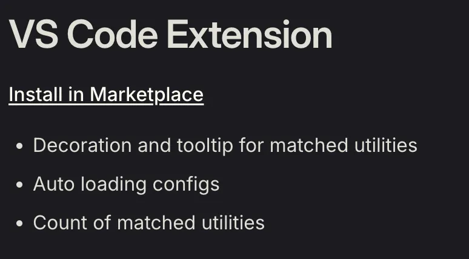

一共提到了 3 个功能点，分别是：

- **装饰 - 提示**
- **自动加载配置**
- **匹配实用工具计数**

下面是对这 3 个功能点的相关介绍。

## 📒 notes - 插件 UnoCSS 功能 - 装饰 + 提示

在 VScode 中，你会发现使用了这款插件给预设的 UnoCSS 类名加上了虚线装饰，并且当你把鼠标悬停在对应的类名上时，会实时弹出一个提示框，让你知道它实际上的 css 是什么。

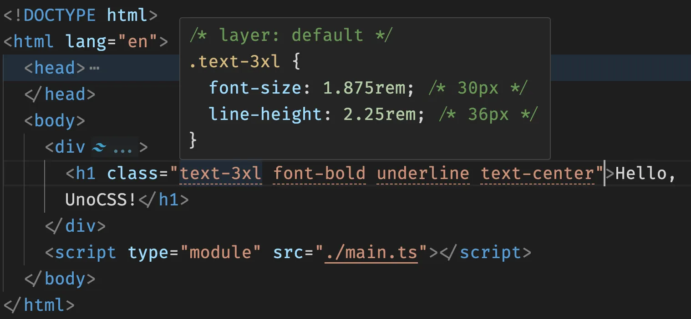


假如你随便写一个类名，比如 `abc`，会发现这玩意儿是没有下划线标注的。通过这种方式，可以让你快速了解到哪些 class 是有效的 UnoCSS。

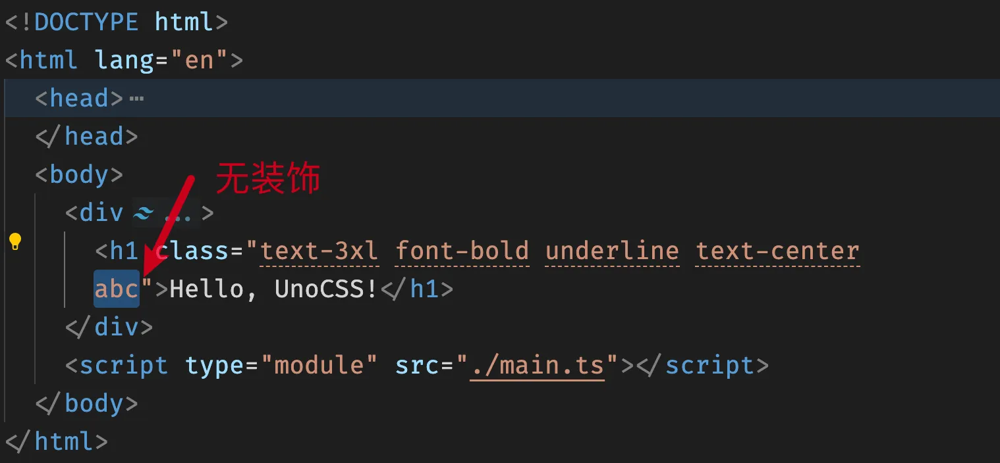


**Q：这功能有什么用呢？**

A：其中一个应用场景就是尽快 **纠错** —— 当你不小心拼写错误的时候，也能够快速识别出来。


## 📒 notes - 插件 UnoCSS 功能 - 自动加载配置
这里说的“自动加载配置”指的是工具或框架能够自动识别和加载配置文件的功能。在像 UnoCSS 这样的工具中，自动加载配置可以简化设置流程，使开发者无需手动指定配置文件路径，工具会自动查找和应用项目中的配置文件。

举个例子，比如我们现在在配置文件 `uno.config.ts` 中添加如下规则。

```typescript
import { defineConfig } from 'unocss'

export default defineConfig({
  // 在这里，你可以自定义一些 CSS 规则
  rules: [
    // 匹配字符串"abc"，并应用样式：字体颜色为红色
    ['abc', { color: 'red' }],
  ],
})
```

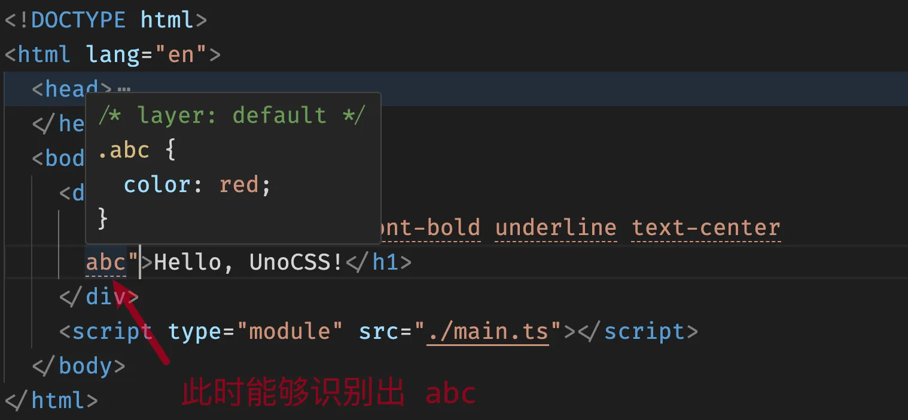

### 提示 - 无配置文件可能会导致插件失效
虽然官方表示如果你的工程中没有 `uno.config.ts` 配置文件的话，那么这个插件将失效。实际测试发现，即便没有准备配置文件，这个插件有时候依旧是可用的。不过最好根据官方描述来走，如果没有提示的话，可以在工程的根目录下新建一个 `uno.config.ts` 配置文件。

```typescript
import { defineConfig } from 'unocss'

export default defineConfig({
  // ...
  // 这里边啥都不配置也是可以的
  // 起码能够解决一个问题 - 让插件 UnoCSS 起作用
})
```

### 槽点 - 提示是无差别的


插件对预设类名的提示，是无差别的。即便是注释中出现匹配的名字，也会被标注下划线。

## 📒 notes - 插件 UnoCSS 功能 - 匹配实用工具的计数

这项功能应该是官方需要收集一些用户的实际使用情况，看看哪些预设的类被使用的比较多，或者有没有未使用的类，从而帮助优化和简化样式表。

## 📒 notes - 插件 Tailwind Fold

- **Q：Tailwind Fold 插件有什么用**
- A：它会暴力地将所有和 class 相关的内容折叠起来，看一下本文当中提供的图片你就明白了。


虽然这是 Tailwind 的工具，但是在写 UnoCSS 时也同样适用。当你使用原子类的 CSS 工具库时，往往会在一个元素上写大量的预设类，这个插件的作用就是把 Class 给折叠起来，当你点击某个元素的 class 时，再给你展开。

若你觉得这些 class 影响到你阅读代码了，可以使用这个工具把他们给给隐藏起来，以“优化”你的代码阅读体验。

> 这里的“优化”暂且打个引号，就个人使用体验来看，它反而在更多时候让阅读代码的成本变得更高了。

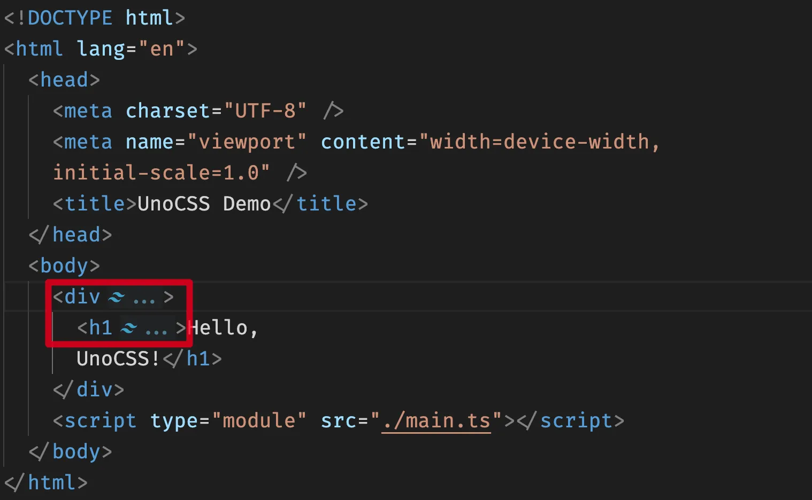

比如，点击 h1 的 class 就会展开它的 class。

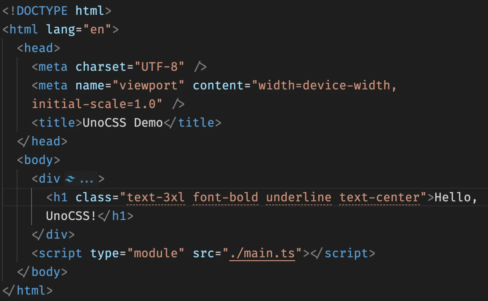

- 使用体验：在开发的大部分阶段，该插件都是 **禁用** 的。我认为在开发中，这个插件带来的体验并不友好，具体表现为：
- 有些动态 class 它也会一视同仁地帮我们给折叠起来，这就导致一些核心逻辑被隐藏，我们还需要找到对应的位置，然后点击一下去查看 class 的相关内容。
- 对于初学 TailwindCSS 或 UnoCSS 的开发者而言，使用 Tailwind Fold 将所有 class 都折叠起来，反而不太好。在这类工具中，预设的类是很多的，反复看这些预设的类，看久了可能自然就记住了，一开始就全都折叠起来，对学习可能还是有害的。
- cv 的成本变高，有些预设类你写过了，如果没有折叠的话你可以快速定位到相关位置，然后直接 cv 搬运一下就行了，可是如果所有都折叠起来的话，那就不容易查找了。

## 📒 notes - 插件 TailwindCSS Tune - TailwindCSS Tune 简介

- **个人评价：**TailwindCSS Tune 插件挺好用的，你只需要写一个预设类，它会提示出该预设类所属的组，以便你更直观地了解到同类型的 class 还有哪些。
  - 不过仅能提示一部分 class 组，有些类名组是没有可视化的展示出来给我们选的。
- 比方说你写了一个 `mr-4`，通过 **UnoCSS 插件** 的智能提示你能够快速了解到它等价的 css 是什么。
  - 
- 通过 TailwindCSS Tune 插件你可以快速了解到和 margin 相关的 class 还有哪些。
  - 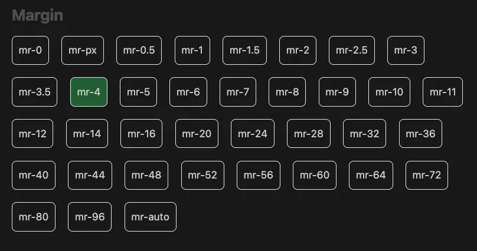
- 学个单词 - tune
  - 首先，让我们来了解下 Tune 这个单词的含义，它表示“调整，调节”的意思。理解语义之后，再来看这个插件就很容易 get 到它是用来解决什么问题的了。
  - 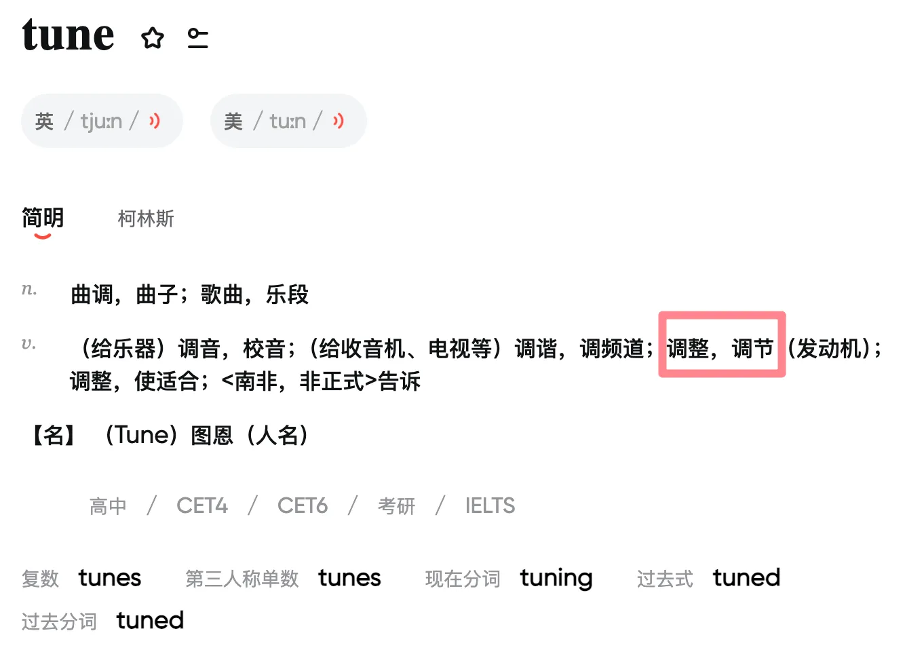

> -_-||
>
> 一开始忘记 tune 表示的含义了，查阅之后联想到调节音量的高低 `tune down`、`tune up` 才恍然大悟。


TailwindCSS Tune 是一个用于调整 Tailwind CSS 类的插件。使用这个插件时，你可以通过将光标放在类字符串上，然后右键打开上下文菜单或从左侧菜单打开。“TailwindCSS Tune”扩展，来修改边栏中的类。这使得调整和实验 Tailwind CSS 类变得更加方便和直观。

```html
<h1 class="text-3xl font-bold ..."></h1>
<!-- 比如，你现在想要查看这一组工具类调节面板
可以右键 -> Tune TailwindCSS
这将在侧边弹出一个调节面板
实现可视化地配置工具类-->
```

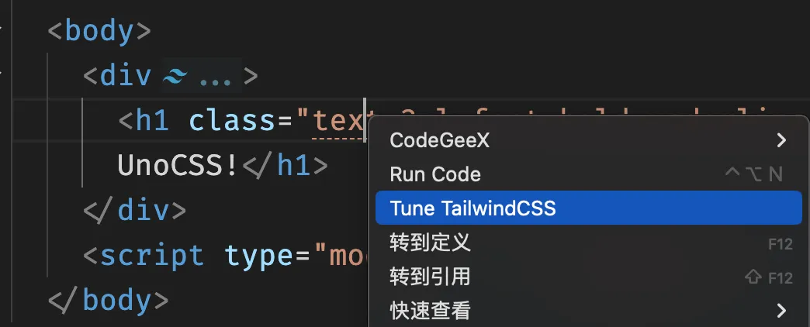

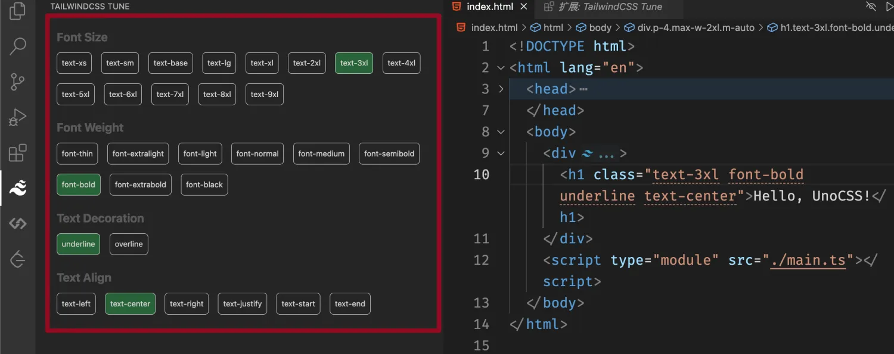

你可以直接在左侧的面板中，选择你需要使用的 class，右边代码区会自动替换。


## 📒 notes - 中的预设（Presets）

Presets 表示“预设”，可以理解为是 UnoCSS 帮你预先封装好的一些功能模块，在数据结构上，它们表现为一个个函数。比如我们在介绍 【UnoCSS 是什么】 中提到“UnoCSS 兼容（compatible） Tailwind CSS 和 Windi CSS 的写法”，这一功能其实就是通过 **默认的 Uno 预设** 来实现的。


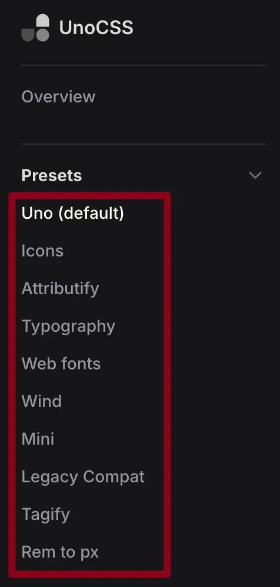

在 **官方文档左侧目录** 中你可以看到都有哪些 Presets 以及它们的功能描述。这些函数可以在 UnoCSS 的配置文件 `uno.config.ts` 中使用，使用方式也非常简单，只需要调用预设函数，将预设函数的返回值丢给 `presets` 字段即可。

每个预设（Preset）都有对应的功能，按需选择即可。

```typescript
// uno.config.ts
import { defineConfig, presetTypography, presetUno } from 'unocss';

export default defineConfig({
  presets: [presetUno(), presetTypography()],
});
```

```typescript
// uno.config.ts
import { defineConfig, presetTypography, presetUno } from 'unocss';

export default defineConfig({
  presets: [presetUno(), presetTypography()],

  // presets 数组定义了要使用的 UnoCSS 预设（Presets）。
  // 通过组合这些预设，你可以在项目中快速启用一系列的样式功能。
  // 在这个例子中，项目将同时使用：
  // 1. 基础的原子样式 presetUno()
  // 2. 专门的排版样式 presetTypography()

  // presetUno
  // doc: https://unocss.dev/presets/uno
  // 这是 UnoCSS 的基础预设，包含了一组通用的实用类，例如边距、填充、文字大小等。
  // 官方描述：
  // This preset attempts to provide a common superset of the popular utility-first frameworks,
  // including Tailwind CSS, Windi CSS, Bootstrap, Tachyons, etc.
  // 翻译翻译：
  // 我已经把其他框架中的预设类构搬运过来了，
  // 比如 Tailwind CSS, Windi CSS, Bootstrap, Tachyons, etc.
  // 你只管用就完事儿，我是兼容它们的语法的。

  // presetTypography
  // doc: https://unocss.dev/presets/typography
  // 这是一个专门用于排版的预设，提供了相关的实用类，如文字对齐、行高、字体风格等。


  // 这种配置方式允许项目仅包含所需的最小 CSS，避免了未使用样式的冗余。
  // 使用预设能够快速地扩展项目的样式功能，同时保持构建输出的优化。
  // UnoCSS 的 JIT 编译方式意味着它在开发过程中实时生成样式，对性能的影响最小化。
});
```

## 💻 demo

### demo 创建的基本流程
1. `pnpm init` 初始化包（需要加上 `type: "module"`，以免后续在引入 `unocss` 插件的时候报错说模块找不到。）
2. `pnpm i unocss vite` 安装 vite 和 unocss
3. `vite.config.ts` 引入 UnoCSS 插件
4. `main.ts` 在入口文件中引入 `virtual:uno.css`，这是一个虚拟模块，包含了由 UnoCSS 插件生成的一些预设样式，如果要在页面上使用 UnoCSS 提供的样式名，必须引入这个模块。
5. `index.html` 准备一个页面，体验 UnoCSS 语法。

### 初始化包，并安装 vite、unocss
```shell
# 初始化包
$ pnpm init
# 跟步骤完成初始化即可

# 安装 unocss、vite
$ pnpm i unocss vite
```

### 准备配置文件
```typescript
// vite.config.ts
import UnoCSS from 'unocss/vite'
import { defineConfig } from 'vite'

export default defineConfig({
  plugins: [
    UnoCSS(),
  ],
})

// uno.config.ts
// 非必需，可有可无，建议加上，为了确保插件 UnoCSS 能够正常运行。
import { defineConfig } from 'unocss'

export default defineConfig({
  // ...UnoCSS options
})
```

### 准备入口文件
```typescript
// main.ts
import 'uno.css'
```

### 准备 .html 文件
基于 UnoCSS 的语法，随便编写一个测试示例 `index.html`。

```html
<div class="p-4 max-w-2xl m-auto">
  <h1 class="text-3xl font-bold underline text-center">Hello, UnoCSS!</h1>
</div>
```

### 查询样式
Tailwind CSS 官方文档，可用于查阅一些预设的类名。

Windi CSS 官方文档，可用于查阅一些预设的类名。

如果对 TailwindCSS 比较熟悉，里边的写法基本都可以直接搬运到 UnoCSS 来用，因为 UnoCSS 对 TailwindCSS 和 Windi CSS 的写法做了兼容，你甚至可以直接对着 TailwindCSS、Windi CSS 文档写 UnoCSS，过渡成本无限接近 0。

UnoCSS，interactive Docs，可交互文档，在搜索框中输入你要查询的类名，可以快速匹配相应的内容。


### 自定义规则
在 uno.config.ts 中定义规则

```typescript
// uno.config.ts
import { defineConfig } from 'unocss'

export default defineConfig({
  rules: [
    ['tdahuyou', { color: 'red', 'font-size': '3rem', 'text-align': 'center' }]
  ]
})
```

## 💻 示例
```typescript
import 'virtual:uno.css'
```

```typescript
import UnoCSS from 'unocss/vite'
import { defineConfig } from 'vite'

export default defineConfig({
  plugins: [UnoCSS()],
})
```

```html
<!DOCTYPE html>
<html lang="en">
  <head>
    <meta charset="UTF-8" />
    <meta name="viewport" content="width=device-width, initial-scale=1.0" />
    <title>UnoCSS Demo</title>
  </head>
  <body>
    <div class="p-4 max-w-2xl m-auto">
      <h1 class="text-3xl font-bold underline text-center">Hello, UnoCSS!</h1>
    </div>
    <script type="module" src="./main.ts"></script>
  </body>
</html>
```


界面上最终看到的效果如下。


下面我们来指定自己创建的规则看看效果。

```typescript
import { defineConfig } from 'unocss'

export default defineConfig({
  rules: [
    ['tdahuyou', { color: 'red', 'font-size': '3rem', 'text-align': 'center' }]
  ]
})
```

这里，我们自定义了一个名为 `.tdahuyou` 的 class，并添加了一些自定义的 css 规则。


```typescript
import UnoCSS from 'unocss/vite'
import UserConfig from './uno.config'
import { defineConfig } from 'vite'

export default defineConfig({
  plugins: [UnoCSS(UserConfig)],
})
```

在 vite 配置文件中将配置好的 uno.config.ts 规则导入进来，丢给 UnoCSS 插件，让规则生效。


然后再进一步去修改 html 文件中的内容，测试一下自定义的样式规则。

```html
<!DOCTYPE html>
<html lang="en">
  <head>
    <meta charset="UTF-8" />
    <meta name="viewport" content="width=device-width, initial-scale=1.0" />
    <title>UnoCSS Demo</title>
  </head>
  <body>
    <div class="p-4 max-w-2xl m-auto">
      <h1 class="text-3xl font-bold underline text-center">Hello, UnoCSS!</h1>
    </div>
    <div class="tdahuyou">自定义的标题 Tdahuyou</div>
    <script type="module" src="./main.ts"></script>
  </body>
</html>
```

下面是最终渲染出来的效果，由此可见，我们自定义的规则已经成功起作用了。


## 🤔 问：`import 'virtual:uno.css'` 虚拟模块 uno.css 是什么？
```typescript
// main.ts
import 'virtual:uno.css' // 虚拟模块
// 导入由 UnoCSS 插件生成的 CSS 样式
// 这个虚拟模块是由 vite.config.ts 中引入的 UnoCSS 插件生成的

// 'virtual:uno.css' 组成
// 符号 virtual: 用于表示虚拟模块
// 模块名 uno.css 表示 UnoCSS 插件生成的 CSS 样式

// 符号 virtual:
// 符号的作用是告诉 vite 这是一个虚拟模块，
// 不是一个实际存在于文件系统中的文件，
// 而是需要通过 UnoCSS 插件来处理的虚拟资源。
// Vite 在开发服务器运行时会捕捉到这个请求，
// 通过 UnoCSS 插件生成相应的 CSS 内容，并将其作为响应返回。

// 问：为什么使用虚拟模块？

// 动态生成
// UnoCSS 根据你的项目中实际使用的 CSS 类来动态生成样式。
// 这意味着只有你用到的那些样式会被包含在最终的 CSS 文件中，有助于减少文件大小和提高加载效率。

// 开发效率
// 使用虚拟模块可以避免手动管理 CSS 文件，减轻开发者的负担，
// 尤其在大型项目中，这可以极大提升开发效率和灵活性。

// 热模块替换
// Vite 支持热模块替换（HMR），这意味着当你在项目中更改样式时，
// 这些更改可以实时反映到浏览器中，无需完全刷新页面。
```

