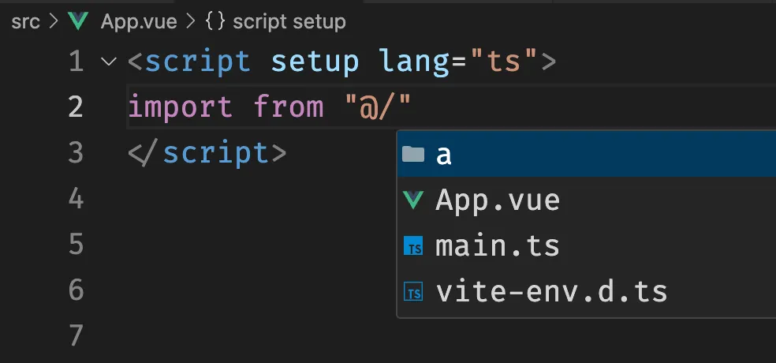

# 0005. Vite 路径别名

- [x] 视频

## 📝 summary

- 类型别名是什么
- 类型别名有什么用
- vite.config.ts 中的 alias 配置
- tsconfig.ts 中的 paths 配置

## 📒 notes - 认识路径别名

### 路径别名是什么

路径别名是为模块导入路径定义的简短别名，用于替代长或复杂的相对路径。

使用别名来简化模块导入路径，特别是在大型项目中，这可以说是必备的基本配置。

就是将你指定的字符替换为一个具体的位置，比如

`@/` 等价于 `/Users/huyouda/Desktop/demo/alias-test/src/`

`@/App.vue` 等价于 `/Users/huyouda/Desktop/demo/alias-test/src/App.vue`

### 路径别名有啥用

- 可以避免长路径或相对路径的使用
- 可以不用担心模块的位置发生变化（这里不是指被引用的模块的位置，是主动引用其他模块的那个模块的位置）
- 对同一模块的引用，方便 cv

比如说，如果你的某个模块 A 嵌套的层次比较深，当这个 A 模块想要引用其他模块的时候，需要通过当前模块的相对位置，以相对路径的方式一层层去找目标模块。类似 A 模块这样嵌套层次较深的模块还有很多，每次在引用其他模块的时候，你都需要根据当前模块的位置去找，就会比较麻烦。相对而言，更容易的方式是每次找的时候，都从 src 源代码的根出发，这样就会方便很多。

```typescript
// your-project-root
// ├── src
// │   ├── App.vue
// │   ├── main.ts
// │   ├── a.ts
// │   └── components
// |       └── A
// |           ├── A.vue


// 比如你现在要在 A.vue 中引入 a.ts
// 使用相对路径的写法：
import a from '../../a'
// 使用路径别名的写法：
import a from '@/a'
```

使用相对路径的写法，还有一些好处，比如，如果 A.vue 的位置发生了变化，也不再需要再去修改模块的路径了，同样可以找到模块 a。如果有一个 B.vue 也要引用 a 模块的话，只需要直接 cv 一下，将 A.vue 中的 `import a from '@/a'` 这条语句给复制下即可。

## 💻 demo


先了解最终要实现一个什么样的效果，然后再看看具体的实现步骤。

### 最终效果
```typescript
// 需要实现的效果
// @/xxxx => src/xxxx
// #/xxxx => types/xxxx

// 比如，在 main.ts 中使用下面的写法是等效的。
import App from '@/App.vue'
import App from './App.vue'

import '@/style.css'
import './style.css'

// 比如，在 App.vue 中，使用下面的写法是等效的。
import HelloWorld from '@/components/HelloWorld.vue'
import HelloWorld from './components/HelloWorld.vue'
```

并且在输入自定义的别名的时候，IDE 能够智能提示对应位置下的模块，如下图所示。


### 实现步骤
#### 配置 vite.config.ts 的 alias
在 vite 配置文件中，指定俩路径别名 `@/`、`#/`，分别映射到根目录下的 src 目录和 types 目录。我们可以通过配置 `alias` 字段来指定路径别名的映射规则，其中 find 字段配置的是路径别名，replacement 用于指定对应的目标位置。

```typescript
import { defineConfig } from 'vite'

export default defineConfig({
  plugins: [vue()],
  resolve: {
    alias: [
      { find: '路径别名', replacement: '等效的目标位置' },
    ],
  },
})
```

配置示例如下。

```typescript
import { defineConfig } from 'vite'
import vue from '@vitejs/plugin-vue'
import { resolve } from 'node:path'

const pathResolve = (dir: string) => resolve(process.cwd(), '.', dir)

// https://vitejs.dev/config/
export default defineConfig({
  plugins: [vue()],
  resolve: {
    alias: [
      { find: /@\//, replacement: pathResolve('src') + '/' }, // @/xxxx => src/xxxx
      { find: /#\//, replacement: pathResolve('types') + '/' }, // #/xxxx => types/xxxx
    ],
  },
})
```

#### 配置 tsconfig.app.json 的
`paths` 字段在 TypeScript 配置文件中用于配置模块的路径映射。

```json
{
  "compilerOptions": {
    // ...
    "baseUrl": ".",
    "paths": {
      "@/*": [ "src/*" ],
      "#/*": [ "types/*" ]
    },
  },
  // ...
}
```

这段配置告诉 TypeScript 编译器如何解析以 `@/`、`#/` 开头的路径，否则在工程中使用以 `@/`、`#/` 开头的路径时，VS Code 会报错，提示模块找不到。

#### 注意缓存问题
如果配置完成后，还是存在找不到模块的报错，可能是因为缓存问题，可以将 VS Code 给退出重新进入试试看。

#### 测试
我们可以随便准备点儿模块来测试一下。

```typescript
// src/a/b.ts
export default 'b'

// types/sum.d.ts
export interface sum {
  (n1: number, n2: number): number
}
```

可以在 `.vue` 或者 `.ts` 文件中测试一下效果。若别名配置成功，你会发现在引入内容的时候，只需要输入前缀 `@/` 或 `#/`，就会自动弹出 `src` 和 `types` 中已有的模块供你选择。




